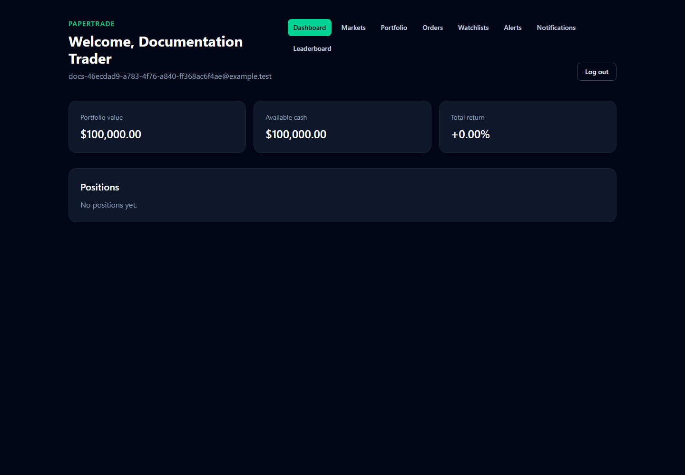
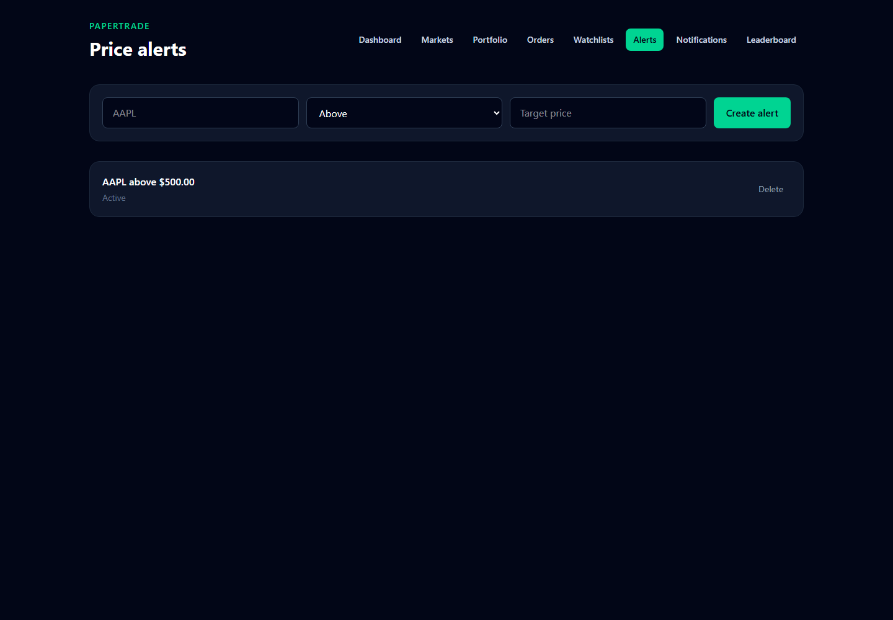

# PaperTrade

PaperTrade is an educational paper-trading application. Users will practice investing with virtual money while using real or delayed market prices.

The backend is organized as a modular monolith with dependencies pointing toward the Domain layer.

## Current status

The four-week roadmap now provides:

- ASP.NET Core API
- React, TypeScript, Vite, and Tailwind frontend
- Browser-to-API status check
- PostgreSQL 18 running through Docker Compose
- Entity Framework Core with Npgsql
- `User` and `Portfolio` domain entities
- One-to-one user and portfolio persistence
- Initial database migration
- Real PostgreSQL integration test
- User registration and login
- Secure password hashing
- Encrypted `HttpOnly` authentication cookies
- Protected current-user and logout endpoints
- FluentValidation request validation
- Authentication unit and integration tests
- Registration and login pages
- Protected dashboard routing
- Cookie-based frontend sessions
- Logout flow
- Client and server validation error display
- Frontend validation tests
- Multi-stage API and frontend Docker images
- Nginx static frontend hosting with SPA route fallback
- Redis development service
- Four-service Docker Compose environment
- Container health checks and dependency ordering
- Persistent PostgreSQL data and authentication keys
- Consistent ProblemDetails error responses
- Safe global exception handling
- Request and response logging without body or cookie logging
- Automated error-contract integration tests
- Playwright authentication end-to-end test
- Finnhub-backed symbol search, quotes, price history, and market status
- Redis cache-aside market data with endpoint-specific expiration times
- Market search and symbol detail pages
- Interactive 1D, 1W, 1M, 3M, and 1Y price charts
- PostgreSQL-backed user watchlists
- Live quote display in watchlists
- Market and watchlist unit, integration, and browser tests
- Atomic market buy and sell orders
- Decimal share quantities and weighted average entry prices
- Open positions and persistent trade records
- Cash, market value, portfolio value, realized P&L, and unrealized P&L
- Insufficient-funds and overselling protection
- Portfolio and order-history pages
- Order review and confirmation UI
- Full PostgreSQL buy/sell integration coverage
- SignalR quote and notification delivery scoped by user and symbol groups
- A background worker that polls owned, watched, alerted, and actively viewed symbols
- One-shot above/below price alerts and a notification center
- A Redis-cached percentage-return leaderboard
- Serilog structured request and trading logs
- OpenTelemetry traces and metrics with optional OTLP export
- Prometheus metrics and liveness/readiness health endpoints
- GitHub Actions backend, frontend, test, and container checks
- Production Compose and deployment documentation

The repository is deployable, but no public cloud environment is attached to this local checkout. See [`deploy/README.md`](deploy/README.md) for the remaining provider-specific steps.

## Technology

### Backend

- .NET 10
- ASP.NET Core
- Entity Framework Core
- PostgreSQL
- Npgsql
- FluentValidation
- ASP.NET Core cookie authentication
- ASP.NET Core ProblemDetails
- SignalR
- Serilog
- OpenTelemetry
- xUnit

### Frontend

- React
- TypeScript
- Vite
- Tailwind CSS
- React Router
- TanStack Query
- React Hook Form
- Zod
- Vitest
- Playwright

### Infrastructure

- Docker
- Docker Compose
- PostgreSQL
- Redis
- Nginx

## Runtime architecture

```text
Browser (React)
  |-- HTTPS REST --------------------------|
  `-- SignalR WebSocket ------------------|
                                           v
                                   ASP.NET Core API
                                    |      |      |
                              PostgreSQL Redis  Finnhub
                                    ^      ^
                                    |      |
                            Market data worker
                         positions/watchlists/alerts
```

SignalR groups isolate quote traffic by symbol and notifications by user. PostgreSQL owns durable application state. Redis holds short-lived market data and leaderboard results.

## Project structure

```text
PaperTrade/
|-- src/
|   |-- backend/
|   |   |-- PaperTrade.Api/
|   |   |-- PaperTrade.Application/
|   |   |-- PaperTrade.Domain/
|   |   `-- PaperTrade.Infrastructure/
|   `-- frontend/
|       `-- papertrade-web/
|-- tests/
|   |-- PaperTrade.UnitTests/
|   `-- PaperTrade.IntegrationTests/
|-- .env.example
|-- .dockerignore
|-- .gitignore
|-- docker-compose.yml
|-- PaperTrade.sln
`-- README.md
```

## Backend dependency direction

```text
Api ------------> Application ----> Domain
 |
 `--------------> Infrastructure --> Application
                                `--> Domain
```

`PaperTrade.Domain` does not depend on ASP.NET Core, Entity Framework Core, PostgreSQL, or external services.

## Prerequisites

Install:

- .NET SDK 10
- Node.js 24 or a compatible version
- npm
- Git
- Docker Desktop

## Run with Docker

Create the local environment file:

```powershell
Copy-Item .env.example .env
```

Change `POSTGRES_PASSWORD` in `.env`. Add a Finnhub key as `FINNHUB_API_KEY` for quotes/search and a Twelve Data key as `TWELVE_DATA_API_KEY` for real OHLC candle history, then build and start the complete application:

```powershell
docker compose up --detach --build
docker compose ps
```

The frontend runs at `http://localhost:5173`, and the API runs at `http://localhost:5044`.

Set `MARKET_DATA_WORKER_ENABLED=false` when developing without a Finnhub key and the database already contains watched or owned symbols.

View container logs:

```powershell
docker compose logs --follow
```

Stop the application without deleting persistent data:

```powershell
docker compose down
```

The `postgres-data` volume preserves database records. The `api-data-protection` volume preserves the keys used to encrypt authentication cookies.

## Run locally for development

Clone the repository and create local environment files:

```powershell
Copy-Item .env.example .env
Copy-Item .env.example src/frontend/papertrade-web/.env.development.local
```

Change `POSTGRES_PASSWORD` in `.env`.

Set the Finnhub API key for local API development with User Secrets:

```powershell
dotnet user-secrets set "MarketData:Finnhub:ApiKey" "YOUR_FINNHUB_API_KEY" --project src/backend/PaperTrade.Api
dotnet user-secrets set "MarketData:TwelveData:ApiKey" "YOUR_TWELVE_DATA_API_KEY" --project src/backend/PaperTrade.Api
```

The app can start without this key. Market endpoints then return a safe `503` ProblemDetails response, while authentication and watchlists continue to work.

Start PostgreSQL and Redis:

```powershell
docker compose up --detach postgres redis
docker compose ps
```

Install and build the backend:

```powershell
dotnet restore PaperTrade.sln
dotnet build PaperTrade.sln
```

Store the database connection string with .NET User Secrets:

```powershell
dotnet user-secrets set "ConnectionStrings:DefaultConnection" "Host=localhost;Port=5432;Database=papertrade;Username=papertrade;Password=YOUR_LOCAL_PASSWORD" --project src/backend/PaperTrade.Api
```

Apply migrations:

```powershell
dotnet ef database update `
  --project src/backend/PaperTrade.Infrastructure `
  --startup-project src/backend/PaperTrade.Api `
  --context PaperTradeDbContext
```

Install frontend dependencies:

```powershell
Set-Location src/frontend/papertrade-web
npm install
Set-Location ../../..
```

## Run the application

Start PostgreSQL, Redis, the hot-reloading API, and the Vite frontend from the repository root with one command:

```powershell
.\scripts\start-dev.ps1
```

Press `Ctrl+C` to stop the API and frontend. PostgreSQL and Redis remain running so their data stays available. Pass `-SkipInfrastructure` when those two services are already running.

You can also start each application separately:

Start the API:

```powershell
dotnet run --project src/backend/PaperTrade.Api --launch-profile http
```

The API runs at `http://localhost:5044`.

In another terminal, start the frontend:

```powershell
Set-Location src/frontend/papertrade-web
npm run dev
```

The frontend runs at `http://localhost:5173`.

## API endpoints

### Status

```http
GET /api/status
```

Response:

```json
{
  "status": "ok"
}
```

### Authentication

```http
POST /api/auth/register
POST /api/auth/login
POST /api/auth/logout
GET  /api/auth/me
```

Registration creates a user and a default `Paper Portfolio` with an initial and cash balance of `$100,000`.

`logout` requires the encrypted `papertrade.auth` cookie. `me` returns the current user or `null` when signed out, which lets the frontend check a session without generating an expected `401` browser error. Validation failures return `400`, duplicate registration returns `409`, and invalid login returns `401`.

### Markets

All market endpoints require authentication:

```http
GET /api/markets/search?q=apple
GET /api/markets/AAPL/quote
GET /api/markets/AAPL/history?timeframe=1M
GET /api/markets/status?exchange=US
```

Supported history timeframes are `1D`, `1W`, `1M`, `3M`, and `1Y`. PaperTrade requests OHLC history from Twelve Data first and falls back to Finnhub when that provider is not configured. Both provider keys are sent in HTTP headers and are never included in frontend bundles, request URLs, or API responses.

Finnhub restricts candle history on some account plans. When neither provider can return history, the terminal keeps its tools visible but does not invent candles. A user can explicitly enable labeled `Demo candles` for interface testing. Real quotes received through SignalR update the active candle at five-second intervals.

Redis uses cache-aside expiration times based on how quickly each response changes:

| Data | Expiration |
| --- | ---: |
| Quote | 15 seconds |
| Market status | 1 minute |
| Symbol search | 10 minutes |
| Price history | 1 hour |

If Redis is unavailable, the API logs the cache failure and calls the market provider directly.

### Watchlists

Watchlist endpoints require authentication and only return records owned by the current user:

```http
GET    /api/watchlists
POST   /api/watchlists
POST   /api/watchlists/{id}/assets
DELETE /api/watchlists/{id}/assets/{symbol}
```

PostgreSQL enforces unique watchlist names per user and unique symbols inside each watchlist. Symbols are normalized to uppercase.

### Trading and portfolio

Trading endpoints require authentication:

```http
POST /api/orders
GET  /api/orders
GET  /api/portfolio
```

Only market orders are accepted. Example request:

```json
{
  "symbol": "AAPL",
  "side": "buy",
  "type": "market",
  "quantity": 5
}
```

The API obtains the latest server-side quote before execution. PostgreSQL then handles the portfolio, position, order, trade, cash, and realized P&L changes in one serializable transaction. A failed operation rolls back all changes.

Buy orders cannot exceed available cash. Sell orders cannot exceed the open position quantity. Quantities and prices use `decimal`, with six database decimal places; cash and P&L are rounded to cents.

Portfolio valuation uses:

```text
Market value = sum(current price × position quantity)
Portfolio value = cash balance + market value
Unrealized P&L = market value - open-position cost basis
Total return % = (portfolio value - initial balance) / initial balance × 100
```

Positions are deleted when their quantity reaches zero. Filled orders and trades remain as the historical record.

### Alerts, notifications, and leaderboard

```http
GET    /api/alerts
POST   /api/alerts
DELETE /api/alerts/{id}
GET    /api/notifications
POST   /api/notifications/{id}/read
GET    /api/leaderboard?page=1&pageSize=20
```

Alerts accept `above` or `below` plus a positive target price. The market worker deactivates a triggered alert, writes one notification, and pushes it through SignalR. Leaderboard results are ordered by percentage return and cached in Redis for one minute.

### Realtime

Authenticated clients connect to:

```text
/hubs/market
```

Clients call `Subscribe(symbol)` and `Unsubscribe(symbol)`. Server events are `QuoteUpdated` and `NotificationReceived`. The worker does not broadcast every symbol to every client.

### Health and telemetry

```http
GET /health/live
GET /health/ready
GET /health
GET /metrics
```

Readiness checks PostgreSQL and Redis. `/metrics` exposes Prometheus-format ASP.NET Core, HTTP client, and runtime metrics. Set `OTEL_EXPORTER_OTLP_ENDPOINT` to send traces and metrics to an OpenTelemetry collector.

## API error contract

API errors use `application/problem+json`. Each response includes a stable error type, HTTP status, request path, and trace identifier:

```json
{
  "type": "urn:papertrade:error:validation",
  "title": "Validation failed.",
  "status": 400,
  "instance": "/api/auth/register",
  "traceId": "0HN...",
  "errors": {
    "email": [
      "Enter a valid email address."
    ]
  }
}
```

Unexpected exceptions are logged by the API, while clients receive a generic `500` response without stack traces or internal exception details.

## Database model

A user has one portfolio and can own multiple watchlists. PostgreSQL enforces:

- Unique user email
- Unique portfolio `user_id`
- User and portfolio foreign-key relationship
- Cascade deletion from user to portfolio
- `numeric(18,2)` money columns
- Nonnegative cash and initial balances
- Unique watchlist names per user
- Unique symbols per watchlist
- Cascade deletion from users to watchlists and from watchlists to items
- Unique open position per portfolio and symbol
- Positive quantities and execution prices
- One trade per filled order
- Cascade deletion from portfolio to positions, orders, and trades
- Indexed active price alerts and user notifications

## Verification

Build the backend:

```powershell
dotnet build PaperTrade.sln
```

Run backend unit tests:

```powershell
dotnet test tests/PaperTrade.UnitTests
```

Run the integration tests after setting `PAPERTRADE_TEST_CONNECTION_STRING`:

```powershell
dotnet test tests/PaperTrade.IntegrationTests
```

Check the frontend:

```powershell
Set-Location src/frontend/papertrade-web
npm run test
npm run lint
npm run build
```

Run the browser test against the Docker stack:

```powershell
docker compose up --detach --build

Set-Location src/frontend/papertrade-web
npx playwright install chromium
npm run test:e2e
Set-Location ../../..
```

The Playwright tests cover authentication, market search, symbol details, watchlists, order confirmation, and the resulting portfolio position. Market provider responses are intercepted in browser tests so the suite does not require a live Finnhub key. The backend integration suite uses a fake provider with real PostgreSQL to verify the complete buy and sell transaction.

## Screenshots

Refresh these images from a running local stack with `npm run screenshots` in `src/frontend/papertrade-web`.





## Continuous integration

`.github/workflows/ci.yml` runs on pull requests and pushes to `main` or `master`. It restores and builds .NET, migrates a PostgreSQL service, runs backend tests, verifies the frontend, and builds both Docker images.

## Production deployment

Use `.env.production.example`, `docker-compose.production.yml`, and [`deploy/README.md`](deploy/README.md). The production stack keeps PostgreSQL and Redis private, persists data-protection keys, applies committed migrations, exposes readiness checks, and expects HTTPS/WebSocket termination from the chosen cloud load balancer or reverse proxy.

Stop the containers without deleting persistent data:

```powershell
docker compose down
```

The named `postgres-data` and `api-data-protection` volumes remain available after the containers stop.
