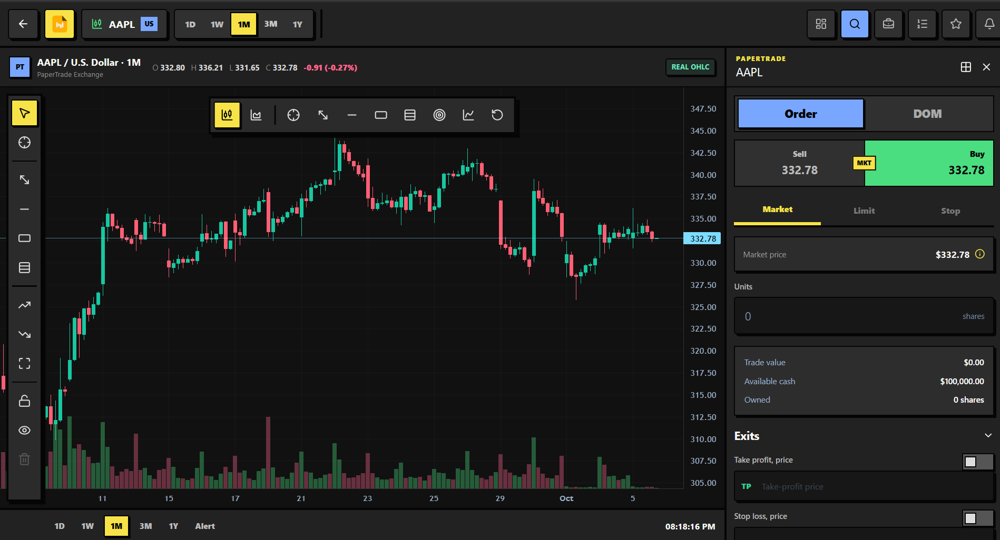

<p align="center">
  
</p>

<h1 align="center">PaperTrade</h1>

<p align="center">
  Practice stock trading with virtual cash, real market data, and no financial risk.
</p>

<p align="center">
  
  
  
  
  
  
</p>



## What it includes

- Real quotes and symbol search through Finnhub
- Real OHLC candle history through Twelve Data
- Interactive candlestick charts, drawing tools, indicators, TP, and SL levels
- Virtual buy and sell orders with a $100,000 starting balance
- Portfolio valuation, positions, order history, and profit/loss tracking
- Watchlists, price alerts, notifications, and a leaderboard
- Cookie-based authentication with protected API routes
- Live updates through SignalR
- PostgreSQL persistence and Redis caching

PaperTrade is for education and development. It does not place real orders or provide financial advice.

## Stack

**Backend:** .NET 10, ASP.NET Core, Entity Framework Core, PostgreSQL, Redis, SignalR, FluentValidation, Serilog, OpenTelemetry, xUnit.

**Frontend:** React 19, TypeScript, Vite, Tailwind CSS, TanStack Query, React Router, React Hook Form, Zod, Lightweight Charts, Vitest, Playwright.

**Infrastructure:** Docker Compose, Nginx, GitHub Actions, Prometheus-compatible metrics.

## Architecture

The backend is a modular monolith using Clean Architecture dependency rules:

```text
Browser
  ├── REST API
  └── SignalR
        │
        ▼
ASP.NET Core API
  ├── Application ──► Domain
  ├── Infrastructure ──► PostgreSQL
  ├── Redis
  └── Finnhub / Twelve Data
```

`PaperTrade.Domain` has no dependency on ASP.NET Core, Entity Framework Core, or external services.

## Quick start

### Requirements

- .NET SDK 10
- Node.js 24 and npm
- Docker Desktop
- Finnhub API key for quotes and search
- Twelve Data API key for candle history

### 1. Configure the environment

From the repository root:

```powershell
Copy-Item .env.example .env
```

Open `.env` and set:

```dotenv
POSTGRES_PASSWORD=your_local_password
FINNHUB_API_KEY=your_finnhub_key
TWELVE_DATA_API_KEY=your_twelve_data_key
```

Never commit `.env`. It is already ignored by Git.

### 2. Start development

The launcher starts PostgreSQL, Redis, the hot-reloading API, and Vite:

```powershell
.\scripts\start-dev.ps1
```

Open:

- Web app: http://localhost:5173
- API: http://localhost:5044
- OpenAPI document: http://localhost:5044/openapi/v1.json

Press `Ctrl+C` in the launcher terminal to stop the API and frontend. PostgreSQL and Redis remain running.

### Run everything with Docker

```powershell
docker compose up --detach --build
docker compose ps
```

Stop the stack without deleting database data:

```powershell
docker compose down
```

## Common commands

Build and test the backend:

```powershell
dotnet build PaperTrade.sln
dotnet test tests/PaperTrade.UnitTests
dotnet test tests/PaperTrade.IntegrationTests
```

Check the frontend:

```powershell
Set-Location src/frontend/papertrade-web
npm install
npm run lint
npm test
npm run build
```

Run browser tests while the application is running:

```powershell
npm run test:e2e
```

Apply database migrations:

```powershell
dotnet ef database update `
  --project src/backend/PaperTrade.Infrastructure `
  --startup-project src/backend/PaperTrade.Api `
  --context PaperTradeDbContext
```

## Project structure

```text
PaperTrade/
├── src/
│   ├── backend/
│   │   ├── PaperTrade.Api/
│   │   ├── PaperTrade.Application/
│   │   ├── PaperTrade.Domain/
│   │   └── PaperTrade.Infrastructure/
│   └── frontend/papertrade-web/
├── tests/
│   ├── PaperTrade.UnitTests/
│   └── PaperTrade.IntegrationTests/
├── deploy/
├── scripts/start-dev.ps1
├── docker-compose.yml
└── PaperTrade.sln
```

## API overview

| Area | Routes |
| --- | --- |
| Authentication | `/api/auth/*` |
| Markets | `/api/markets/*` |
| Portfolio and orders | `/api/portfolio`, `/api/orders` |
| Watchlists | `/api/watchlists/*` |
| Alerts and notifications | `/api/alerts/*`, `/api/notifications/*` |
| Leaderboard | `/api/leaderboard` |
| Health | `/health/live`, `/health/ready` |
| Metrics | `/metrics` |

Market-data keys stay in the backend environment. They are never included in frontend bundles or API responses.

## Deployment

Production Compose files and provider-specific notes are in [deploy/README.md](deploy/README.md).
